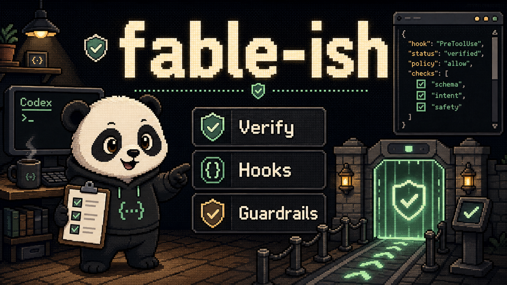

# fable-ish



`fable-ish` is a Codex plugin that adds a lightweight verification gate around
coding tasks while keeping the original `fable-ish` skill name.
`fablish` is treated only as a common typo alias in instructions; it is not a
second plugin or skill name.

It is not a new orchestrator and does not rename the workflow. The plugin
packages one skill plus lifecycle hooks for task classification, risky command
checks, verification tracking, and stop-time completion review.

## What Is Included

- Plugin manifest: `.codex-plugin/plugin.json`
- Skill: `skills/fable-ish/SKILL.md`
- Hook config: `hooks/hooks.json`
- Hook entrypoints:
  - `hooks/user_prompt_submit.py`
  - `hooks/pre_tool_use.py`
  - `hooks/post_tool_use.py`
  - `hooks/stop_gate.py`
- Standard-library helper scripts under `scripts/`

## Install And Trust

Add this plugin through a Codex marketplace entry or copy it into a plugin
location referenced by a marketplace.

After installing or changing the plugin, restart Codex. Codex discovers the
default plugin hook path at `hooks/hooks.json`. Plugin-bundled hooks are not
trusted automatically. Open `/hooks`, review the current hook definitions, and
trust them before relying on the gate.

Hooks can be disabled globally with:

```toml
[features]
hooks = false
```

If hooks are disabled or not trusted, the skill still works as reusable
instructions, but the mechanical gates will not run.

For a personal local install, keep the plugin at:

```text
~/plugins/fable-ish
```

and expose it from:

```text
~/.agents/plugins/marketplace.json
```

Then install with:

```bash
codex plugin add fable-ish@personal
```

## Hook Roles

- `UserPromptSubmit`: classifies the request as `quick`, `normal`, `deep`, or
  `blocked`, then injects short Codex context.
- `PreToolUse`: blocks destructive local actions, infrastructure destruction,
  and risky patch actions before supported tool calls.
- `PostToolUse`: records changed-file signals, verification commands, and
  failures in a small JSON ledger. Verification coverage is recorded only as
  `direct`, `generic`, `uncertain`, or `none`; it is not a quality guarantee.
- `Stop`: asks Codex to continue when normal or deep work lacks verification
  evidence, with a maximum of two blocks.

## Optional Rules And Permissions

Hooks are the default plugin guardrail. For stronger command policy, copy
`rules/fable-ish.rules` into an active Codex config layer's `rules/` directory
and test it with:

```bash
codex execpolicy check --pretty --rules rules/fable-ish.rules -- git reset --hard
```

For secret-file protection, adapt `examples/permissions.toml` into your Codex
configuration. Secret output, deployment commands, database push commands,
package publishing, migration deploy commands, and infrastructure apply/up
commands are not blocked by the fable-ish hooks. The safe workflow commands
`ship` and `yeet`, including their slash-command and `gstack` wrapper forms,
are also not blocked.

## Limits

Codex hooks are guardrails, not a complete security boundary.

- Multiple matching hooks can run concurrently.
- `PreToolUse` does not intercept every possible shell path.
- `PostToolUse` cannot undo side effects from a completed command.
- Hooks require review and trust before running.
- Stop blocking is intentionally capped to avoid infinite loops.
- Rules and permission profiles are optional configuration layers; this plugin
  documents examples but does not silently install them.

Use sandboxing, approvals, tests, linters, and review policies for stronger
enforcement.

## Excluded By Design

- No MCP server.
- No app integration.
- No external API.
- No web server or UI.
- No database.
- No background worker.
- No LLM classifier.
- No GitHub, Slack, Gmail, or Notion integration.
- No complex policy engine.

## Verification

Run these checks from the plugin root:

```bash
python3 -m json.tool .codex-plugin/plugin.json
python3 -m json.tool hooks/hooks.json
python3 -m py_compile hooks/*.py scripts/*.py
python3 -m unittest discover -s tests
```

Sample hook inputs can be piped into each hook script with `PLUGIN_DATA` set to a
temporary directory.
